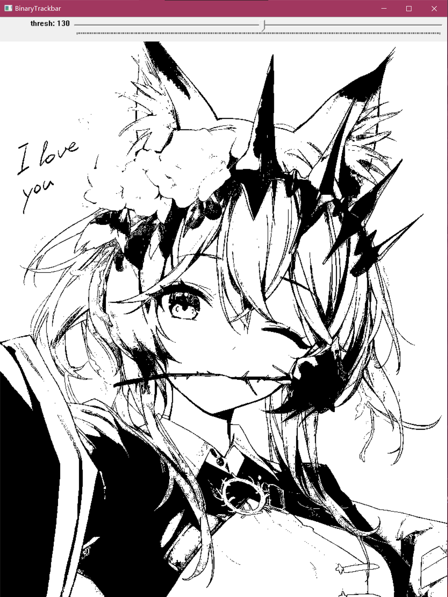
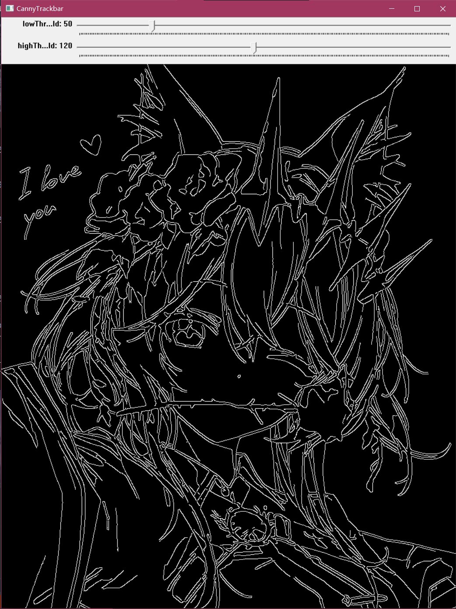
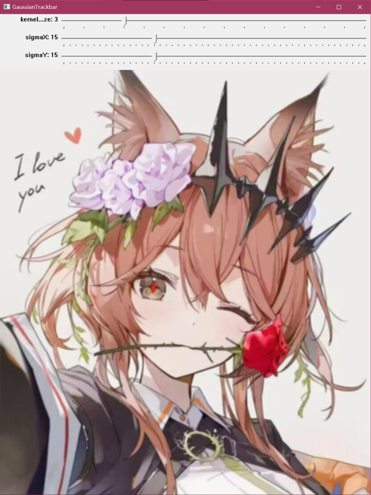
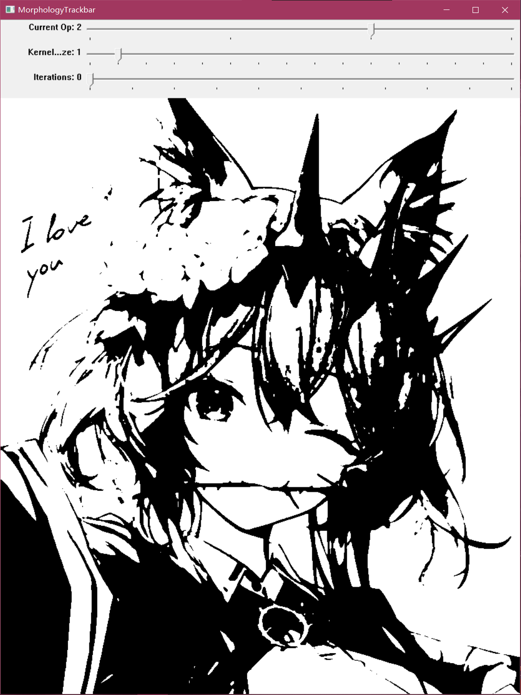
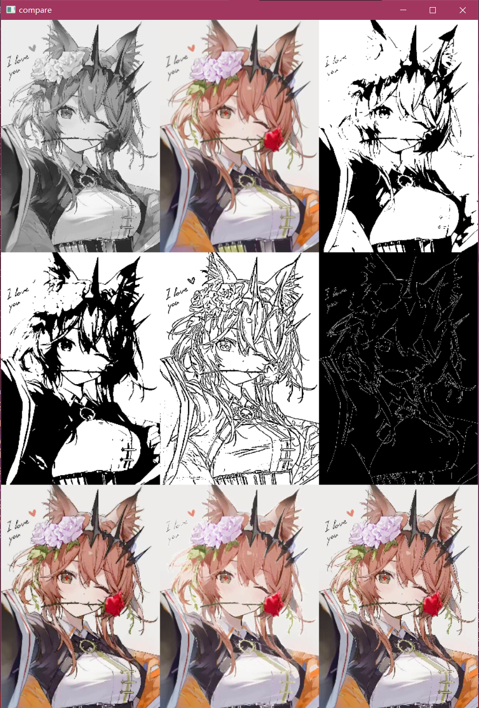

# opencv-image-lab
一个用于练习 OpenCV 基础图像处理与参数调试的实验项目，包含高斯滤波、二值化、边缘检测、形态学处理等模块，并提供 Trackbar 交互工具用于观察参数变化效果。

功能列表：
- 图像读取与显示
- 灰度化
- 高斯滤波
- 固定阈值二值化
- Otsu 二值化
- Canny 边缘检测
- 调整图像尺寸
- 腐蚀、膨胀、开运算、闭运算
- 对比图拼接
- 多个 Trackbar 调参工具(可通过输入自由调用)

## 项目结构
- `src/`：源代码
- `assets/input/`：输入图片
- `assets/output/`：输出结果
- `docs/`：开发笔记

## 运行方式
- 对比图使用Compare_main
- 滑块调参使用Trackbar_main
- 可通过命令行自行传入图片

## 依赖环境
- 本项目使用visual studio 2022构建，未尝试过其他环境下的运行
- 需要安装openCV库且版本在openCV3以上

## 效果展示图

### Binary 滑块

### Canny 滑块

### Gaussian 滑块

### Morphology 滑块

### Compare 效果图

